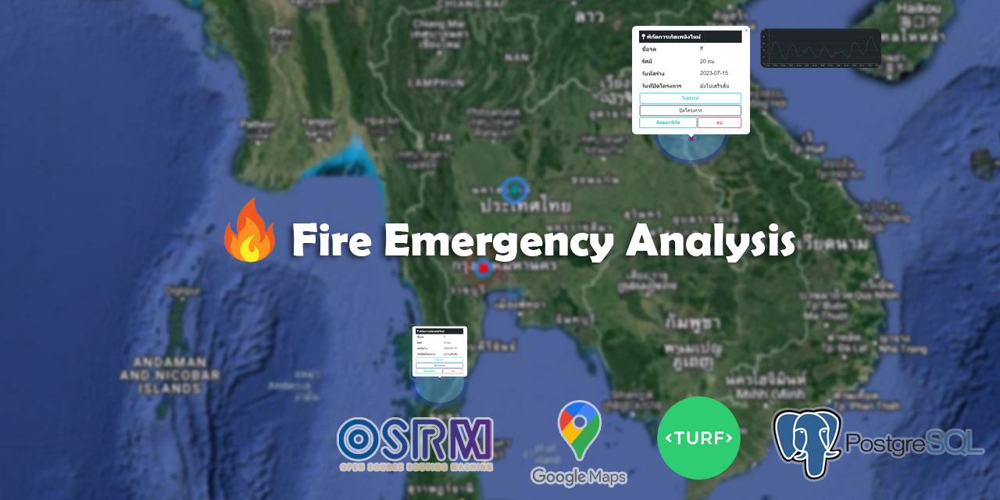

# :world_map: Spatial Analysis with Turf.js 

**:black_nib: Description:**
The project to import geospatial data into PostgreSQL, as well as to utilize geojson to display location on a Web map and using turf library that functional to analyze and calculate geospatial data on web map variously.

**:black_nib: Related project:**
- [Leaflet](https://github.com/Leaflet/Leaflet) - JavaScript library for mobile-friendly interactive maps.
- [osrm-backend](https://github.com/Project-OSRM/osrm-backend) - High performance routing engine written in C++ designed to run on OpenStreetMap data.
- [turf](https://github.com/Turfjs/turf) - A modular geospatial engine written in JavaScript.

**:black_nib: Requirements:**
- Web server
- Fire station location - [geofabrik]([https://urbandata.theurbanis.com/files/4/27](http://download.geofabrik.de/asia/thailand.html))
  - Fire station location is in the POI shape file, and I already extract it to geojson format (/geojson/fire_station.geojson)

**:black_nib: Features:**
### Use Google base map including hybird, street and satelite base map

### Find the nearest fire station and start navigation system to bring you to the destination

### Display an icon that indicates the status of a project

### Project Filtering 

### User-friendly ui to re-open/close project

### Every piece of information is kept in prosgresql and accessible through the pgAdmin

